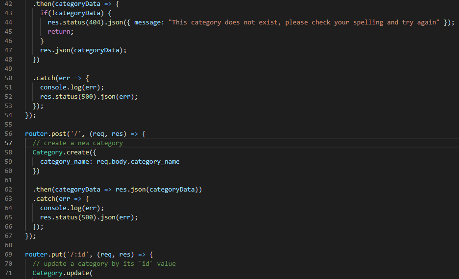
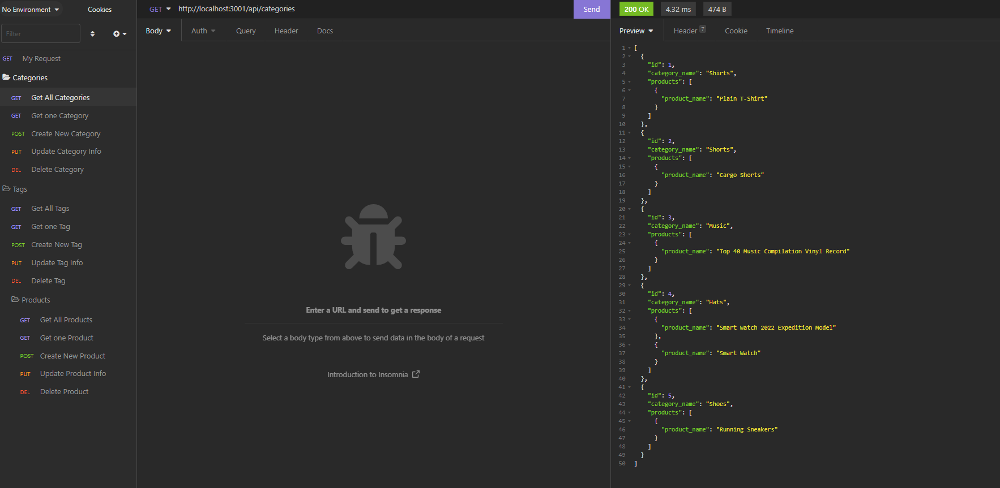

# Curtain Commerce ORM Backend

## Description
Curtain Commerce is a business solution with serious potential in today's internet-retail saturated market. This application is designed for companies with an e-commerce sector to alter their product data quickly and easily. Curtain Commerce uses mySQL database, sequelize, and insomnia to update product data in a clean and organized way.

## User Story
* AS A manager at an internet retail company

* I WANT a back end for my e-commerce website that uses the latest technologies

* SO THAT my company can compete with other e-commerce companies

## Table of Contents
- [Built With](#languages)
- [Source Code Screenshot](#Code)
- [Installation](#Install)
- [Usage](#Usage)
- [URLs For Testing](#Links)
- [Contribution](#contributing)
- [Questions](#questions)

## Built With
* JavaScript

## Source Code Screenshot

## Installation

To run this application on your own machine, you must first clone this repository to your local drive. Next, create a <code>.env</code> file that contains the database name along with your mySQL username and password. Since this application requires node.js, mySQL2, dotenv, and sequelize, these packages must be installed to your directory. To do this, type <code>npm init</code> in the terminal and follow the prompts until finished. Next, type in <code>npm install</code> to install all the necessary packages.

NOTE: Inorder to test routes and view backend functionality in action, the application "Insomnia" must be installed.

* Example Insomnia Route Test 

* Insomnia Installation links and instructions can be found [Here](https://insomnia.rest/download)

If you're having trouble, take a look at my installation/running the application walkthrough video [Here](https://watch.screencastify.com/v/nVlfFZknPdLJyXWdRv2b)

## URLs For Route Testing
* Products: http://localhost:3001/api/products
* Categories: http://localhost:3001/api/categories
* Tags: http://localhost:3001/api/tags

## Usage

After successful installation, touched on in the section above, type <code>npm run seed</code> in the terminal to populate the database with the given default data. Next, type <code>npm run seed</code> to start the server; if this is successful you should see a successful connection message. You can now open the Insomnia app and test the routes on your local server!

## Contribution
- This project was made by Evan Carlson and contains references and material learned in the University of Minnesota Web Dev Bootcamp.
- The starter code repository, made by [Xandromus](https://github.com/Xandromus), can be accessed [HERE](https://github.com/coding-boot-camp/fantastic-umbrella)

No Outside Contributions are being accepted at this time.

## Questions
If you have any questions on this application, feel free to reach me through my GitHub profile [epc318](https://github.com/epc318) or [E-mail](carl4917@umn.edu):

### ©️2022 E-commerce Experts Inc.